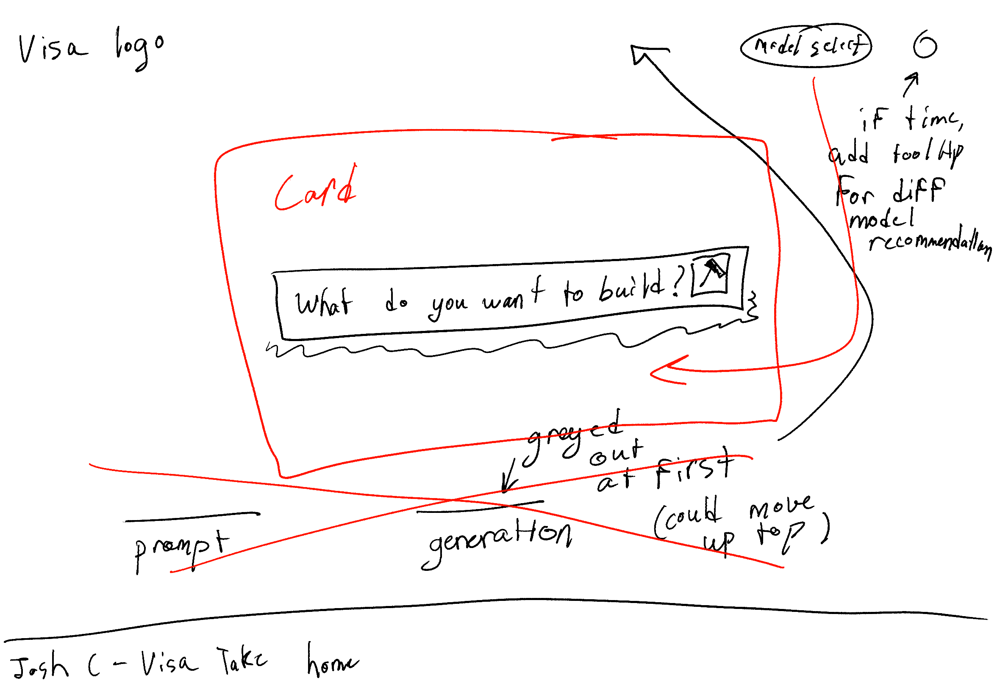
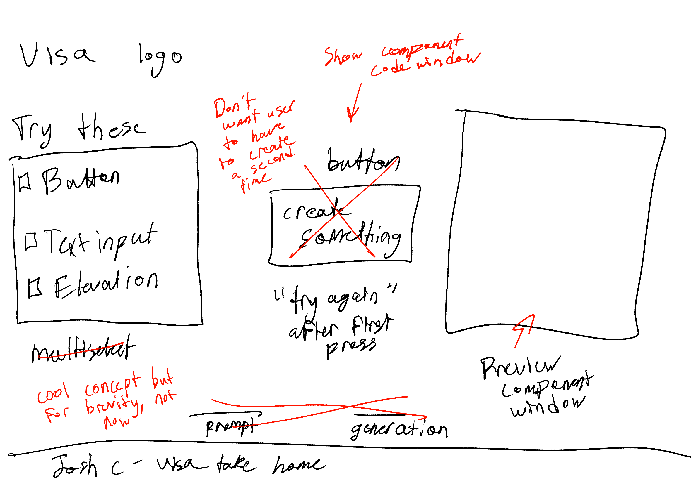
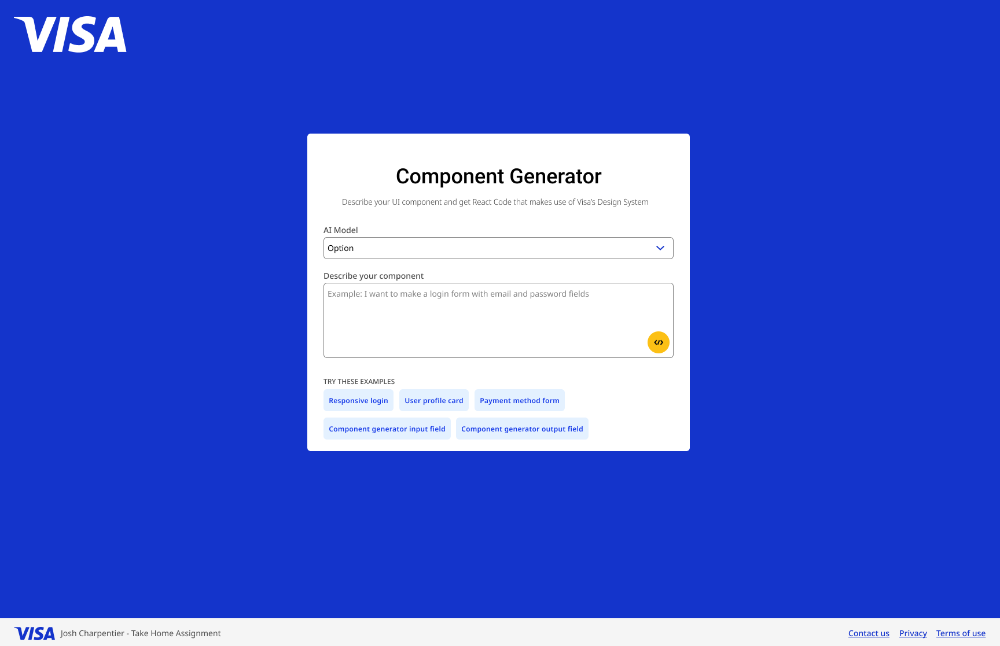
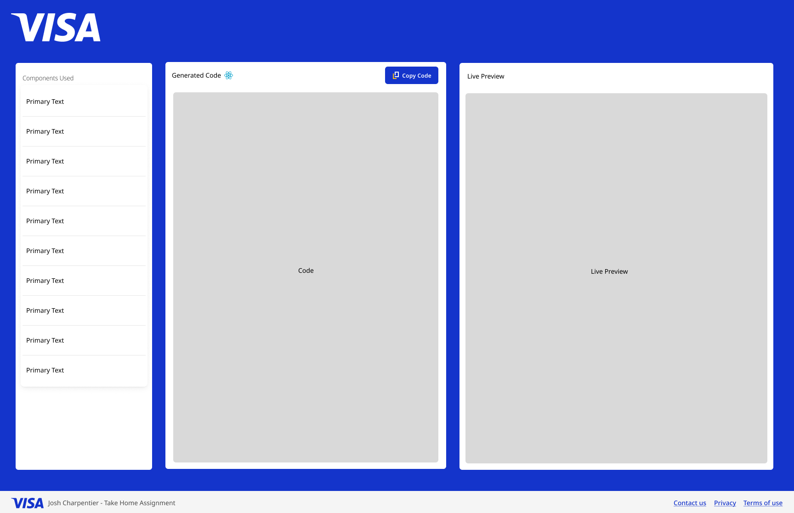

# Development Timeline ⏰

## Documentation Guidelines 📖

- Documentation is logged as: activity (time taken in minutes)
- **Bolded text like this indicates Claude was used to assist**

## Day 1: Friday (Total time: ~10 min) 🚀

**Goal:** Get the ideas flowing - make something and let it sit for tomorrow 💡

- Creating low-fidelity prototype to revisit tomorrow and make iterations (10)

### Design Process 🎨

I took an introduction to human-computer interaction course where we learned about the UX design process. It has stuck with me that without a clear vision of what to create, the development cycle of a project will take much longer and involve much more wasted effort. As such, these prototypes proved crucial for having a clear vision of where I was heading from the start. In a perfect world, maybe I could have done more in the UX project like brainstorm with an affinity diagram (something I like to do on my personal projects) or have more time for high-fidelity prototype revisions. Still, I had to make minimal changes from my Figma designs to my final product, which made me happy to see.

## Day 2: Saturday (Total time: ~50 min) 🎨

**Goal:** Modify old designs and finalize a high-fidelity design ✨

- Revisit and modify low-fidelity prototypes after a second look (5)
- Creating Figma high-fidelity prototypes basic drafts in Figma (15)
- **Get input on current iterations and help to adjust styling to align more with Visa's Design System components (20)**
- **"Turn these rough designs into some cleaner, more structured view across both pages"**
- Further tweaks were then made based on Claude's verbal feedback

**Design Reference:** https://www.figma.com/design/5Tap2bgKQdziqmDqiC5dRw/VPDS-Icons--Community---Copy-?node-id=22285-36

## Day 3: Sunday (Current total: ~4-5 hrs) 💻

**Goal:** Create front-end and mock functionality 🔧

### Technical Setup ⚙️

- **Set up bare bones React app with the following:**
  - TypeScript implementation
  - Organized file structure for styles and classnames
  - `npm install @visa/nova-react@latest`
  - Themes and styles integration
- Further refining to remove unnecessary files/content to make project as minimal as possible

### Development Process 🛠️

The first thing I wanted to do was get the layout looking as displayed in my prototypes, using Visa's design system components. From there, my goal was to add mock functionality, make the webpage responsive, and finalize the project by addressing accessibility concerns.

The main two components are the prompt.tsx file and generation.tsx file as shown in my prototypes. Each incorporates multiple VPDS components.

**My approach:** I would make the components and implement the Visa design system components first - then I would have Claude help me style and edit the components to match my prototypes. I would revise and review each of Claude's changes before accepting them. After a large update was done, I would review Claude's changes one final time in the Git log before proceeding to ensure accuracy and understanding of code.

Notably, sometimes Claude would inevitably not style things properly/cause other issues with its code. I handled these issues myself. One notable example - I tried to steer away from sizing based on percentages and pixels (for the most part). I wanted as much of the colors and fonts to use VPSD variable names and styling as possible. This was often something I had to update as Claude had limited knowledge about VPSD.

### Project Features ✨

I created a VPSD list component to display components used with a link to their VPSD page. **I didn't know how best to handle code blocks, despite seeing them in AI agents, so I asked Claude to help me to do this - apparently there is a code tag, who knew?** The prototype was fairly straightforward as well thanks to hardcoding. I just added in the prompt.tsx component because it serves the purpose of showing a component that aggregates other components. Notably, this does not currently render directly from the code window - these are two individually hardcoded elements.

### Future Goals 🎯

Goals moving forward for this step:

1. I would have liked to color code the code preview screen to make the code more readable like in an IDE. From what I found online, this would potentially require a Javascript/React parser library of which I felt my time for this project would have been better spent elsewhere, for now at least.

2. Along with goal (1), I would have liked to directly link the preview to the code window, however, **after discussing this with Claude, I was told that this would also require some kind of Javascript/React parser for safety reasons, as rendering any code in the window could be dangerous. I was also recommended to use iFrame which seems to be some kind of isolated view, however, that also seemed like a steep enough learning curve to put off for this project, for the time being.**

3. I would have liked to refresh my knowledge of how to create an Express.js endpoint to mimic an API call. I've utilized Express.js and FastAPI in personal projects, however, I often have heavy AI support when creating these. I can always understand the files well when I have completed them, however, I could not create one without some focused refreshment. By the time I was ready to start working on this, I was past the estimated time limit, and as such, I feel being honest about my time on this project was a better option than forcing a backend into this project.

4. This project uses conditional rendering for navigation - I believe Next.js creates routes based on folder structure, which can be navigated to with a router library built into Next.js. That being said, I've not tried this before, and didn't feel it was a valuable thing to focus on at the time, however, I would likely tinker with this going forward to production to allow for the use of the back arrow instead of having to press "New Component" on the generation.tsx screen.

5. I suppose it's worth noting that I didn't add a footer as indicated in my prototypes. This did not seem like a crucial addition given the time estimation.

## Day 4: Monday (Current total: ~1 hr) 📱

**Goal:** Create responsiveness and address accessibility concerns ♿

### Responsiveness Implementation 📱

Responsiveness was admittedly a pain - windows kept overflowing from the view and the grid system was frustrating to deal with at times, creating one row of two and then a row of one on smaller screens. **I tried to find issues with responsiveness, pose them to Claude, test fixes, and modify code as needed. One big change Claude made that I wouldn't have known how to do is make the grid system either 3 or 1 column based on screen size without exception. This ensures a nice look regardless of screen size.**

Responsive classes from VPSD proved helpful, however some behaviors like scaling of the preview component proved more difficult.

### Accessibility Testing ♿

To address accessibility concerns, there was one primary tool I used: WAVE. This is a browser extension my professor told us about in my building user interfaces course. I right click on my component pages and it highlights errors and warnings with accessibility guidelines. There was only one error I got initially and two warnings. The error was that I didn't have aria-labels for the links to the VPSD. This has since been resolved. The two warnings were that I didn't have any sections on my prompt and generation pages respectively. This has also since been resolved. Font sizes, colors, etc. passed WAVE's checks. I had to use some intuition when choosing colors, however it wasn't that hard. I did originally have the react icon on the generation page be its default cyan color, however, I felt visibility would not be ideal on the white background, so I updated it to be Visa's blue color.

## Day 5: Tuesday (Current total: ~1 hr) 📚

**Goal:** Documentation and Deployment 🚀

### Documentation Process 📝

I wrote all of the words in this document myself (besides the headers) though I did **have Claude organize the README.md for me. I am now likely going to have Claude help clean up the project (remove unused code/search for duplicate code or functions that could be separated out). I'll also have Claude add some emojis to this README because who doesn't love emojis?**

**I ended up having Claude add document headers and do some last minute styling to PromptInput on the preview screen as well. I've tested everything works - we are ready for Deployment time!**

This is a step I like to take before deployment. I will then deploy and send my project over to be assessed. This was fun to work on, and could be a really useful project if fleshed out with an actual backend.